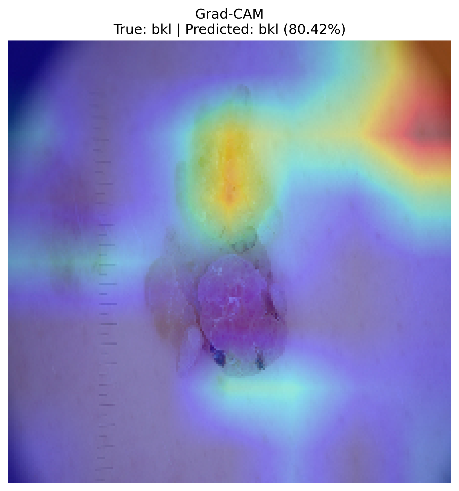

# Skin Lesion Classification Using Explainable AI

## Project Overview

This project focuses on the automated classification of skin lesions using a deep learning model based on **ResNet50** and **Explainable AI (XAI)** using **Grad-CAM**.

The model is trained on the **HAM10000** dataset and classifies dermatoscopic skin lesion images into seven diagnostic categories.

Grad-CAM is used to visualize the regions of an input image that contribute most to the model's prediction, providing greater interpretability of the classification results.

## Dataset

The project uses the HAM10000 dataset containing **10,015 dermatoscopic images**.

The seven classes are:

- `akiec` - Actinic keratoses / intraepithelial carcinoma
- `bcc` - Basal cell carcinoma
- `bkl` - Benign keratosis-like lesions
- `df` - Dermatofibroma
- `mel` - Melanoma
- `nv` - Melanocytic nevi
- `vasc` - Vascular lesions

The dataset was divided into:

- Training: **6,409 images**
- Validation: **1,592 images**
- Testing: **2,014 images**

Images belonging to the same lesion were kept within the same split using `lesion_id` grouping to reduce data leakage.

## Model

The project uses a pretrained **ResNet50** architecture with ImageNet weights.

The classification pipeline consists of:

1. Image resizing to 224 × 224 pixels
2. Data augmentation
3. ResNet50 feature extraction
4. Global Average Pooling
5. Dropout
6. Seven-class softmax classification

The model was trained in two phases.

### Phase 1 - Initial Training

The pretrained ResNet50 layers were frozen while the classification layers were trained.

### Phase 2 - Fine-Tuning

Deeper ResNet50 layers were unfrozen and fine-tuned with a lower learning rate.

Class weights were used during training to address the class imbalance present in HAM10000.

## Results

- Best validation accuracy: **70.16%**
- Test accuracy: **68.97%**
- Macro average F1-score: **46.08%**
- Weighted average F1-score: **70.89%**

## Classification Performance

| Class | Precision | Recall | F1-score |
|---|---:|---:|---:|
| AKIEC | 30.41% | 66.18% | 41.67% |
| BCC | 54.55% | 30.00% | 38.71% |
| BKL | 36.36% | 62.44% | 45.96% |
| DF | 11.57% | 63.64% | 19.58% |
| MEL | 50.47% | 24.32% | 32.83% |
| NV | 91.81% | 80.56% | 85.81% |
| VASC | 57.14% | 58.82% | 57.97% |

## Explainable AI - Grad-CAM

Grad-CAM (Gradient-weighted Class Activation Mapping) was used to provide a visual explanation of the model's predictions.

The generated heatmap highlights image regions that contributed to the predicted class.

### Example

- True class: **BKL**
- Predicted class: **BKL**
- Confidence: **80.42%**



## Limitations

The dataset is highly imbalanced, with the `nv` class containing substantially more samples than several other lesion categories.

The model therefore performs better on some classes than others. In particular, the per-class results show lower F1-scores for classes such as `DF`, `MEL`, and `BCC`.

The test accuracy should therefore not be interpreted as uniform performance across all seven classes.

This project is intended for academic and research purposes and is not a medical diagnostic system.

## Technologies Used

- Python
- TensorFlow / Keras
- ResNet50
- NumPy
- Pandas
- Scikit-learn
- Matplotlib
- Grad-CAM
- Google Colab

## Repository Contents

```text
.
├── best_resnet50.keras
├── classification_report.txt
├── confusion_matrix.png
├── gradcam_bkl_example.png
├── 235805100_AnnShamDaniel_presentation.pptx
├── 235805100_AnnShamDaniel_report.docx
├── README.md
└── .gitignore

Important Note

This project is intended for academic and research purposes. The model is not a medical diagnostic system and should not be used as a substitute for evaluation by a qualified healthcare professional.

Author
Ann Sham Daniel
